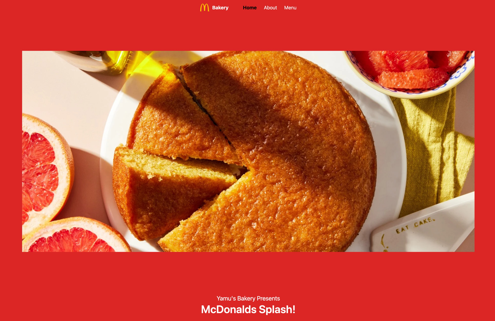

#### Mac Bakery

###### Date Started: 03/25/2024

###### Last Updated: 06/19/2024

###### Deployment: Netlify

###### Get Started with React: [what to do ?](https://github.com/fullstacktutorials/install-reactjs)

---

###### Tech Stack: HTML5 ReactJs Tailwind Redux-Toolkit

---

##### Welcome to Mac Bakery! If you're here, you're checking out how to make your own unique baking website and you can rest assured that you come to the right place. Feel free to explore, and remember, the code is yours to adapt and use however you like. Enjoy!

---

---

###### Features:

##### - Responsive design that adapts to different screen sizes.

##### - Tailwind CSS file for styling.

##### - Redux-toolki to manage state.

###### Process:

##### - Started with a basic react template.

##### - Added redux and used it to manage the count of a counter

##### - Built on that and started to work on my navigation reducer

##### - Filled out each section with relevant information and structured them properly.

##### - Styled the webpage using an Tailwind

###### Learnings:

##### - Gained a deeper understanding on Tailwind, React & Redux.

##### - Improved skills in responsive web design.

